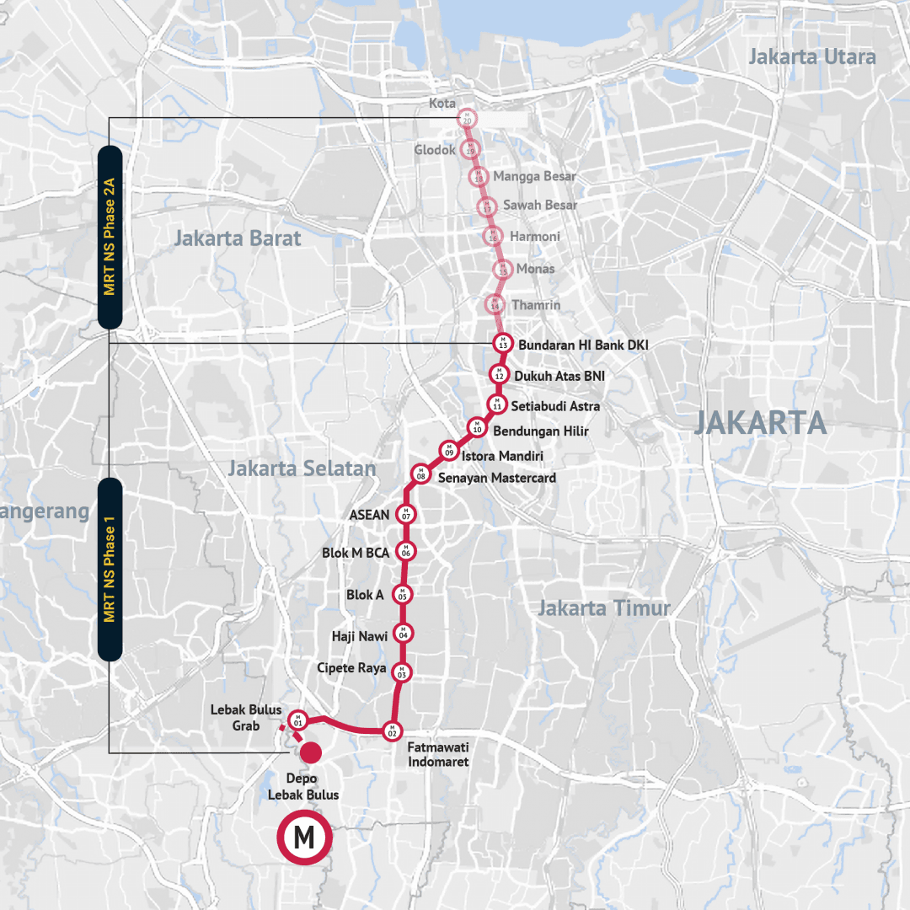
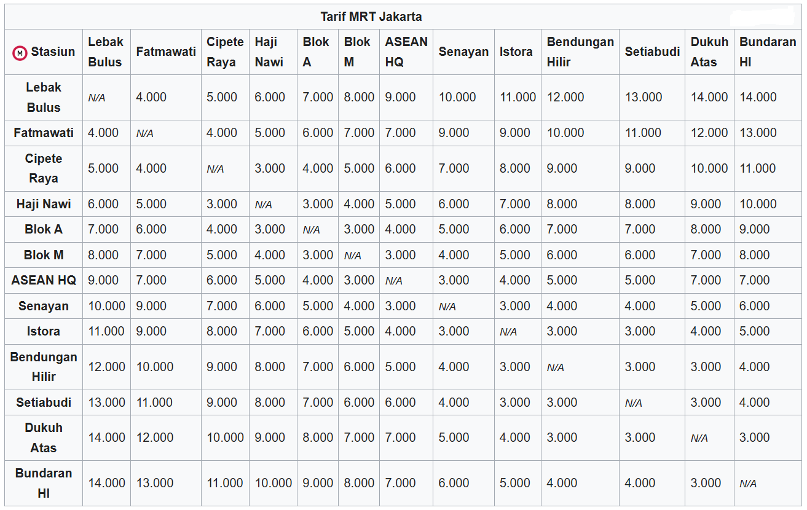
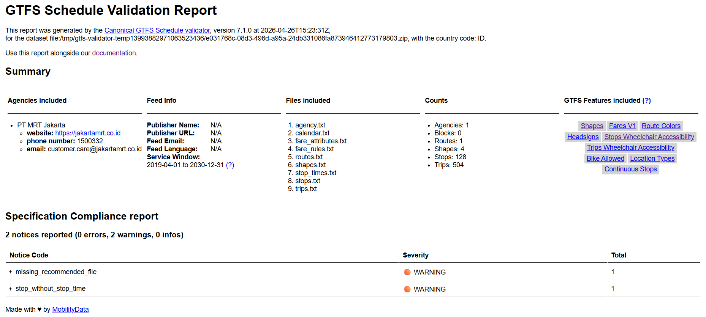

---

## Table of Contents
- [Build GTFS](#build-gtfs)
- [ Profil MRT Jakarta Lin Utara-Selatan Fase 1](#-profil-mrt-jakarta-lin-utara-selatan-fase-1)
- [Data](#data)
  - [Jadwal Keberangkatan](#jadwal-keberangkatan)
  - [Stop (Stasiun, Platform, Entrance)](#stop-stasiun-platform-entrance)
  - [Shape / Jalur](#shape--jalur)
  - [Tarif Perjalanan](#tarif-perjalanan)
- [How to Run](#how-to-run)
- [Validation GTFS](#validation-gtfs)
- [License](#license)


# Build GTFS

[**`General Transit Feed Specification (GTFS)`**](https://developers.google.com/transit/gtfs/) adalah standar format data yang digunakan untuk mendeskripsikan informasi transportasi publik seperti rute, jadwal, dan halte/stasiun dalam bentuk file teks yang terstruktur.

GTFS terdiri dari kumpulan file **CSV (Comma-Separated Values)** dengan ekstensi `.txt` yang dikompres menjadi satu file `.zip`. Setiap file memiliki skema kolom tertentu yang telah distandarisasi. GTFS terdiri dari dua Varian Utama yaitu:

- `GTFS Static`, data statis yang menggambarkan "rencana" layanan transportasi tidak berubah secara real-time. Biasanya diperbarui secara berkala (mingguan/bulanan) ketika ada perubahan jadwal atau rute.
- `GTFS Realtime`, data dinamis yang menggambarkan kondisi aktual layanan saat ini (Realtime). Menggunakan format Protocol Buffers (protobuf), diperbarui setiap beberapa detik hingga menit. Dengan GTFS-Realtime, Informasi keterlambatan, pembatalan, perubahan jadwal perjalanan dapat diketahui secara live, selain itu dapat mengetahui posisi GPS kendaraan secara real-time di peta. GTFS Realtime tidak bisa berdiri sendiri, membutuhkan GTFS Static sebagai acuan.

File GTFS dapat langsung digunakan pada routing engine seperti **OpenTripPlanner (OTP)**, **Google Maps**, atau platform transit lainnya yang mendukung format GTFS.

*Dokumentasi Resmi:* [GTFS Reference](https://gtfs.org/documentation/overview/)

---

Pada repositori ini akan dijelaskan proses *build* file GTFS pada satu  jupyter notebook (.ipnyb) yang mencakup seluruh proses pembuatan `GTFS Static` untuk operasi layanan **`MRT Jakarta Lin Utara-Selatan Fase 1`**  dalam satu alur kerja yang terdokumentasi secara lengkap. Berikut ini file yang akan di-*build* pada notebook ini:

| File | Status | Deskripsi Singkat |
|------|--------|------------------|
| `agency.txt` | ✅ Required | Informasi operator (PT MRT Jakarta) |
| `stops.txt` | ✅ Required | Data perihal stasiun (nama, koordinat, zona) |
| `routes.txt` | ✅ Required | Data rute/layanan (warna, tipe, referensi agency) |
| `trips.txt` | ✅ Required | Data perjalanan spesifik (route, direction) |
| `stop_times.txt` | ✅ Required | Jadwal kedatangan/keberangkatan di tiap stasiun |
| `calendar.txt` | ⚠️ Conditional | Jadwal operasional reguler (Senin-Minggu) |
| `fare_attributes.txt` | ❌ Optional | Informasi tarif/ticketing |
| `fare_rules.txt` | ❌ Optional | Aturan penerapan tarif |
| `shapes.txt` | ❌ Optional | Koordinat polyline untuk visualisasi rute di peta |

---

Setelah notebook selesai dijalankan, project ini akan memiliki struktur seperti ini:

```
gtfs_mrt_jakarta/
├── agency.txt
├── calendar.txt
├── fare_attributes.txt
├── fare_rules.txt
├── routes.txt
├── shapes.txt
├── stops.txt
├── stop_times.txt
└── trips.txt
```


#  Profil MRT Jakarta Lin Utara-Selatan Fase 1


*source: [Transport for Jakarta – Forum Diskusi Transportasi Jakarta (TFJ-FDTJ)](https://transportforjakarta.or.id/)*


---
| Profil | Detail |
|---|---|
| Jenis Layanan | Mass Rapid Transit |
| Operator | PT MRT Jakarta (Perseroda) |
| Short Name | MRTJ |
| Website | https://jakartamrt.co.id |
| Telepon | 1500-332 |
| Email | customer.care@jakartamrt.co.id |
| Lin | Utara-Selatan Fase 1 |
| Kode Lin | NS *(North-South)* |
| Warna Lin |    |
| Depo | Lebak Bulus |
| Terminus Selatan | Stasiun Lebak Bulus Bank Syariah Indonesia (M01) |
| Terminus Utara | Stasiun Bundaran HI Bank Jakarta (M13) |
| Jumlah Stasiun | 13 stasiun (7 stasiun layang dan 6 stasiun bawah tanah) |
| Panjang Jalur | ±15,7 km |
| Karakteristik Lintas | Layang dan bawah tanah |
| Lebar Sepur | 1.067 mm |
| Headway | 5 menit *(07.00–09.00 & 17.00–19.00 (Weekday Only)* · 10 menit *(di luar jam sibuk)* |
| Tarif | Rp3.000 – Rp14.000 |
| Jam Operasi | 05.00 – 24.00 WIB |
| Mulai Beroperasi | 1 April 2019 |



*source: [Website Resmi MRT Jakarta](https://www.jakartamrt.co.id/)*

**`Daftar Stasiun`**

<table>
  <thead>
    <tr>
      <th>No</th>
      <th>Nama Stasiun</th>
      <th>Short Name</th>
      <th>Kode Stasiun</th>
      <th>Karakteristik</th>
    </tr>
  </thead>
  <tbody>
    <tr>
      <td>1</td>
      <td>Lebak Bulus Bank Syariah Indonesia</td>
      <td>LBB</td>
      <td>M01</td>
      <td rowspan="7">Layang</td>
    </tr>
    <tr>
      <td>2</td>
      <td>Fatmawati Indomaret</td>
      <td>FTM</td>
      <td>M02</td>
    </tr>
    <tr>
      <td>3</td>
      <td>Cipete Raya TUKU</td>
      <td>CPT</td>
      <td>M03</td>
    </tr>
    <tr>
      <td>4</td>
      <td>Haji Nawi</td>
      <td>HJN</td>
      <td>M04</td>
    </tr>
    <tr>
      <td>5</td>
      <td>Blok A</td>
      <td>BKA</td>
      <td>M05</td>
    </tr>
    <tr>
      <td>6</td>
      <td>Blok M BCA</td>
      <td>BKM</td>
      <td>M06</td>
    </tr>
    <tr>
      <td>7</td>
      <td>ASEAN Headquarters</td>
      <td>ASN</td>
      <td>M07</td>
    </tr>
    <tr>
      <td>8</td>
      <td>Senayan Mastercard</td>
      <td>SNY</td>
      <td>M08</td>
      <td rowspan="6">Bawah Tanah</td>
    </tr>
    <tr>
      <td>9</td>
      <td>Istora Mandiri</td>
      <td>IST</td>
      <td>M09</td>
    </tr>
    <tr>
      <td>10</td>
      <td>Bendungan Hilir</td>
      <td>BNH</td>
      <td>M10</td>
    </tr>
    <tr>
      <td>11</td>
      <td>Setiabudi Astra</td>
      <td>STB</td>
      <td>M11</td>
    </tr>
    <tr>
      <td>12</td>
      <td>Dukuh Atas BNI</td>
      <td>DKA</td>
      <td>M12</td>
    </tr>
    <tr>
      <td>13</td>
      <td>Bundaran HI Bank Jakarta</td>
      <td>BHI</td>
      <td>M13</td>
    </tr>
  </tbody>
</table>


# Data

Data berikut menjadi dasar dalam membuat file GTFS MRT Jakarta Lin Utara-Selatan Fase 1.

## Jadwal Keberangkatan

Data jadwal keberangkatan bersumber dari [website resmi MRT Jakarta](https://www.jakartamrt.co.id/jadwal-keberangkatan) dan telah dikonversi ke format CSV dengan pengelompokan sebagai berikut:

- Arah perjalanan (Lebak Bulus → Bundaran HI dan sebaliknya)
- Jenis hari operasi (Weekday / Weekend)
- Diurutkan berdasarkan waktu keberangkatan
- Setiap keberangkatan dianggap sebagai **1 trip**

Data jadwal hasil pengelompokan tersedia di [`data/jadwal-keberangkatan/`](data/jadwal-keberangkatan/).

`Weekday (Senin–Jumat)`

| Jenis Trip | Asal | Tujuan | Jumlah Trip |
|---|---|---|:---:|
| Full trip | Lebak Bulus | Bundaran HI | 141 |
| Full trip | Bundaran HI | Lebak Bulus | 142 |
| Short trip pagi | Blok M | Bundaran HI | 1 |
| Short trip malam | Lebak Bulus | Blok M | 1 |
| **Total** | | | **285** |

`Weekend (Sabtu–Minggu)`

| Jenis Trip | Asal | Tujuan | Jumlah Trip |
|---|---|---|:---:|
| Full trip | Lebak Bulus | Bundaran HI | 108 |
| Full trip | Bundaran HI | Lebak Bulus | 109 |
| Short trip pagi | Blok M | Bundaran HI | 1 |
| Short trip malam | Lebak Bulus | Blok M | 1 |
| **Total** | | | **219** |

Terkait dengan nama `trip_id` berikut ini format yang digunakan:

Penamaan `trip_id` terdiri dari 5 komponen yang dipisahkan tanda hubung (`-`):

```
NS  -  WD  -  LBB  -  BHI  -  001
│      │      │       │       │
│      │      │       │       └── Nomor urut keberangkatan (3 digit, mulai 001)
│      │      │       └────────── Kode stasiun tujuan
│      │      └────────────────── Kode stasiun asal
│      └───────────────────────── Jenis hari operasi (WD/WE)
└──────────────────────────────── Kode Lin
```

Untuk short trip, ditambahkan komponen ST sebelum nomor urut:

```
NS  -  WD  -  LBB  -  BKM  -  ST  -  001
│      │      │       │       │      │
│      │      │       │       │      └── Nomor urut keberangkatan
│      │      │       │       └───────── Penanda Short Trip (ST)
│      │      │       └───────────────── Kode stasiun tujuan
│      │      └───────────────────────── Kode stasiun asal
│      └──────────────────────────────── Jenis hari operasi
└─────────────────────────────────────── Kode Lin
```

Catatan:

* `ST` berfungsi sebagai flag eksplisit untuk membedakan short trip vs full trip
* Format trip_id di atas merupakan inisiatif penyusunan sendiri untuk kebutuhan pengolahan data GTFS dan bukan standar resmi dari operator MRT Jakarta.
* Operator MRT Jakarta kemungkinan memiliki sistem penamaan internal tersendiri, seperti nomor perjalanan kereta (train number / nomor kereta) dengan aturan khusus yang tidak dipublikasikan secara umum.
* Oleh karena itu, trip_id dalam dataset ini bersifat custom dan digunakan semata untuk keperluan identifikasi unik tiap perjalanan dalam GTFS.


## Stop (Stasiun, Platform, Entrance)

Data ini berisi informasi seluruh titik pemberhentian dalam sistem MRT Jakarta yang mencakup level stasiun (parent station), platform (boarding area), hingga entrance (akses masuk/keluar). Data ini digunakan untuk membangun struktur hierarki `stops.txt` dalam GTFS, memastikan keterkaitan antar elemen serta akurasi lokasi geografis setiap titik layanan penumpang. Seluruh titik koordinat (node) setiap stop diperoleh dari data `OpenStreetMap (OSM)` yang bersifat open source.

| Nama Stop | Tipe | Platform | Node OSM |
|---|---|:---:|---|
| Stasiun MRT Lebak Bulus Bank Syariah Indonesia | Parent station | — | https://www.openstreetmap.org/node/6577753463 |
| Stasiun MRT Lebak Bulus Bank Syariah Indonesia | Platform | 1 | https://www.openstreetmap.org/node/6195584522 |
| Stasiun MRT Lebak Bulus Bank Syariah Indonesia | Platform | 2 | https://www.openstreetmap.org/node/6195584521 |
| Stasiun MRT Lebak Bulus Bank Syariah Indonesia Akses A | Entrance | — | https://www.openstreetmap.org/node/11512591668 |
| Stasiun MRT Lebak Bulus Bank Syariah Indonesia Akses B | Entrance | — | https://www.openstreetmap.org/node/11512593774 |
| Stasiun MRT Lebak Bulus Bank Syariah Indonesia Akses C | Entrance | — | https://www.openstreetmap.org/node/11512593771 |
| Stasiun MRT Lebak Bulus Bank Syariah Indonesia Akses D | Entrance | — | https://www.openstreetmap.org/node/11512591650 |
| Stasiun MRT Lebak Bulus Bank Syariah Indonesia Akses E | Entrance | — | https://www.openstreetmap.org/node/13724422004 |
| Stasiun MRT Lebak Bulus Bank Syariah Indonesia Akses F | Entrance | — | https://www.openstreetmap.org/node/11512591660 |
| Stasiun MRT Lebak Bulus Bank Syariah Indonesia Elevator Akses B-C | Entrance | — | https://www.openstreetmap.org/node/12042877951 |
| Stasiun MRT Lebak Bulus Bank Syariah Indonesia Elevator Akses E-F | Entrance | — | https://www.openstreetmap.org/node/13736824753 |
| Stasiun MRT Fatmawati Indomaret | Parent station | — | https://www.openstreetmap.org/node/6195584512 |
| Stasiun MRT Fatmawati Indomaret | Platform | 1 | https://www.openstreetmap.org/node/6577753462 |
| Stasiun MRT Fatmawati Indomaret | Platform | 2 | https://www.openstreetmap.org/node/6195584511 |
| Stasiun MRT Fatmawati Indomaret Akses A | Entrance | — | https://www.openstreetmap.org/node/12042877815 |
| Stasiun MRT Fatmawati Indomaret Akses B | Entrance | — | https://www.openstreetmap.org/node/12042877899 |
| Stasiun MRT Fatmawati Indomaret Akses C | Entrance | — | https://www.openstreetmap.org/node/12042877900 |
| Stasiun MRT Fatmawati Indomaret Akses D | Entrance | — | https://www.openstreetmap.org/node/12042877807 |
| Stasiun MRT Fatmawati Indomaret Elevator Akses D | Entrance | — | https://www.openstreetmap.org/node/12042877905 |
| Stasiun MRT Cipete Raya TUKU | Parent station | — | https://www.openstreetmap.org/node/6196107729 |
| Stasiun MRT Cipete Raya TUKU | Platform | 1 | https://www.openstreetmap.org/node/3859688994 |
| Stasiun MRT Cipete Raya TUKU | Platform | 2 | https://www.openstreetmap.org/node/5015723484 |
| Stasiun MRT Cipete Raya TUKU Akses A | Entrance | — | https://www.openstreetmap.org/node/12041984687 |
| Stasiun MRT Cipete Raya TUKU Akses B | Entrance | — | https://www.openstreetmap.org/node/12041984705 |
| Stasiun MRT Cipete Raya TUKU Akses C | Entrance | — | https://www.openstreetmap.org/node/12041984706 |
| Stasiun MRT Cipete Raya TUKU Akses D | Entrance | — | https://www.openstreetmap.org/node/12041984808 |
| Stasiun MRT Cipete Raya TUKU Akses E | Entrance | — | https://www.openstreetmap.org/node/12041984807 |
| Stasiun MRT Cipete Raya TUKU Akses F | Entrance | — | https://www.openstreetmap.org/node/12041984815 |
| Stasiun MRT Cipete Raya TUKU Elevator Akses B-C | Entrance | — | https://www.openstreetmap.org/node/12041984713 |
| Stasiun MRT Cipete Raya TUKU Elevator Akses E-F | Entrance | — | https://www.openstreetmap.org/node/12041984818 |
| Stasiun MRT Haji Nawi | Parent station | — | https://www.openstreetmap.org/node/6196107728 |
| Stasiun MRT Haji Nawi | Platform | 1 | https://www.openstreetmap.org/node/6195584506 |
| Stasiun MRT Haji Nawi | Platform | 2 | https://www.openstreetmap.org/node/6195584505 |
| Stasiun MRT Haji Nawi Akses A | Entrance | — | https://www.openstreetmap.org/node/10119709555 |
| Stasiun MRT Haji Nawi Akses B | Entrance | — | https://www.openstreetmap.org/node/10119709559 |
| Stasiun MRT Haji Nawi Akses C | Entrance | — | https://www.openstreetmap.org/node/12041655730 |
| Stasiun MRT Haji Nawi Akses D | Entrance | — | https://www.openstreetmap.org/node/12041655731 |
| Stasiun MRT Haji Nawi Akses E | Entrance | — | https://www.openstreetmap.org/node/10119754535 |
| Stasiun MRT Haji Nawi Elevator Akses A-B | Entrance | — | https://www.openstreetmap.org/node/13739242082 |
| Stasiun MRT Haji Nawi Elevator Akses D-E | Entrance | — | https://www.openstreetmap.org/node/12041655718 |
| Stasiun MRT Blok A | Parent station | — | https://www.openstreetmap.org/node/6196107727 |
| Stasiun MRT Blok A | Platform | 1 | https://www.openstreetmap.org/node/6195584500 |
| Stasiun MRT Blok A | Platform | 2 | https://www.openstreetmap.org/node/6195584499 |
| Stasiun MRT Blok A Akses A | Entrance | — | https://www.openstreetmap.org/node/12033813753 |
| Stasiun MRT Blok A Akses B | Entrance | — | https://www.openstreetmap.org/node/12033813759 |
| Stasiun MRT Blok A Akses C | Entrance | — | https://www.openstreetmap.org/node/4908429960 |
| Stasiun MRT Blok A Akses D | Entrance | — | https://www.openstreetmap.org/node/12033813715 |
| Stasiun MRT Blok A Elevator Akses A-B | Entrance | — | https://www.openstreetmap.org/node/12033813762 |
| Stasiun MRT Blok A Elevator Akses C-D | Entrance | — | https://www.openstreetmap.org/node/12033813721 |
| Stasiun MRT Blok M BCA | Parent station | — | https://www.openstreetmap.org/node/6196107726 |
| Stasiun MRT Blok M BCA | Platform | 1 | https://ww.openstreetmap.org/node/6195584488 |
| Stasiun MRT Blok M BCA | Platform | 2 | https://www.openstreetmap.org/node/6195584487 |
| Stasiun MRT Blok M BCA | Platform | 3 | https://www.openstreetmap.org/node/6195584486 |
| Stasiun MRT Blok M BCA Akses A | Entrance | — | https://www.openstreetmap.org/node/12033477003 |
| Stasiun MRT Blok M BCA Akses B | Entrance | — | https://www.openstreetmap.org/node/12033477013 |
| Stasiun MRT Blok M BCA Akses C | Entrance | — | https://www.openstreetmap.org/node/12029431513 |
| Stasiun MRT Blok M BCA Akses D | Entrance | — | https://www.openstreetmap.org/node/12029431514 |
| Stasiun MRT Blok M BCA Akses E | Entrance | — | https://www.openstreetmap.org/node/12029431503 |
| Stasiun MRT Blok M BCA Akses F | Entrance | — | https://www.openstreetmap.org/node/12029431504 |
| Stasiun MRT Blok M BCA Elevator Akses B-C | Entrance | — | https://www.openstreetmap.org/node/12033477014 |
| Stasiun MRT Blok M BCA Elevator Akses E-F | Entrance | — | https://www.openstreetmap.org/node/12033475891 |
| Stasiun MRT ASEAN Headquarters | Parent station | — | https://www.openstreetmap.org/node/4695686975 |
| Stasiun MRT ASEAN Headquarters | Platform | 1 | https://www.openstreetmap.org/node/6195583574 |
| Stasiun MRT ASEAN Headquarters | Platform | 2 | https://www.openstreetmap.org/node/6195583573 |
| Stasiun MRT ASEAN Headquarters Akses A | Entrance | — | https://www.openstreetmap.org/node/9811053913 |
| Stasiun MRT ASEAN Headquarters Akses B | Entrance | — | https://www.openstreetmap.org/node/9811053912 |
| Stasiun MRT ASEAN Headquarters Akses C | Entrance | — | https://www.openstreetmap.org/node/9811053911 |
| Stasiun MRT ASEAN Headquarters Akses D | Entrance | — | https://www.openstreetmap.org/node/11368580750 |
| Stasiun MRT ASEAN Headquarters Akses E | Entrance | — | https://www.openstreetmap.org/node/11368580702 |
| Stasiun MRT ASEAN Headquarters Akses F | Entrance | — | https://www.openstreetmap.org/node/11368580761 |
| Stasiun MRT ASEAN Headquarters Elevator Akses A | Entrance | — | https://www.openstreetmap.org/node/12033397117 |
| Stasiun MRT ASEAN Headquarters Elevator Akses B-C | Entrance | — | https://www.openstreetmap.org/node/12033396852 |
| Stasiun MRT Senayan Mastercard | Parent station | — | https://www.openstreetmap.org/node/6196107724 |
| Stasiun MRT Senayan Mastercard | Platform | 1 | https://www.openstreetmap.org/node/6195583572 |
| Stasiun MRT Senayan Mastercard | Platform | 2 | https://www.openstreetmap.org/node/6195583571 |
| Stasiun MRT Senayan Mastercard Akses A | Entrance | — | https://www.openstreetmap.org/node/10121357638 |
| Stasiun MRT Senayan Mastercard Akses B | Entrance | — | https://www.openstreetmap.org/node/10121357641 |
| Stasiun MRT Senayan Mastercard Akses C | Entrance | — | https://www.openstreetmap.org/node/4908434444 |
| Stasiun MRT Senayan Mastercard Akses D | Entrance | — | https://www.openstreetmap.org/node/10121357642 |
| Stasiun MRT Senayan Mastercard Elevator Akses A-B  | Entrance | — | https://www.openstreetmap.org/node/10121357639 |
| Stasiun MRT Senayan Mastercard Elevator Akses C-D | Entrance | — | https://www.openstreetmap.org/node/10121357640 |
| Stasiun MRT Istora Mandiri | Parent station | — | https://www.openstreetmap.org/node/6196107723 |
| Stasiun MRT Istora Mandiri | Platform | 1 | https://www.openstreetmap.org/node/6124539585 |
| Stasiun MRT Istora Mandiri | Platform | 2 | https://www.openstreetmap.org/node/6195583570 |
| Stasiun MRT Istora Mandiri Akses A | Entrance | — | https://www.openstreetmap.org/node/10121357663 |
| Stasiun MRT Istora Mandiri Akses B | Entrance | — | https://www.openstreetmap.org/node/10121357658 |
| Stasiun MRT Istora Mandiri Akses C | Entrance | — | https://www.openstreetmap.org/node/10121357662 |
| Stasiun MRT Istora Mandiri Akses D | Entrance | — | https://www.openstreetmap.org/node/10121357661 |
| Stasiun MRT Istora Mandiri Elevator Akses A-B | Entrance | — | https://www.openstreetmap.org/node/10121357659 |
| Stasiun MRT Istora Mandiri Elevator Akses C-D | Entrance | — | https://www.openstreetmap.org/node/10121357660 |
| Stasiun MRT Bendungan Hilir | Parent station | — | https://www.openstreetmap.org/node/6196107722 |
| Stasiun MRT Bendungan Hilir | Platform | 1 | https://www.openstreetmap.org/node/3859689022 |
| Stasiun MRT Bendungan Hilir | Platform | 2 | https://www.openstreetmap.org/node/6195583569 |
| Stasiun MRT Bendungan Hilir Akses A | Entrance | — | https://www.openstreetmap.org/node/10121357657 |
| Stasiun MRT Bendungan Hilir Akses B | Entrance | — | https://www.openstreetmap.org/node/10121357653 |
| Stasiun MRT Bendungan Hilir Akses C | Entrance | — | https://www.openstreetmap.org/node/10121357656 |
| Stasiun MRT Bendungan Hilir Elevator Akses A-B | Entrance | — | https://www.openstreetmap.org/node/10121357655 |
| Stasiun MRT Bendungan Hilir Elevator Akses C | Entrance | — | https://www.openstreetmap.org/node/10121357654 |
| Stasiun MRT Setiabudi Astra | Parent station | — | https://www.openstreetmap.org/node/6196107721 |
| Stasiun MRT Setiabudi Astra | Platform | 1 | https://www.openstreetmap.org/node/3859689032 |
| Stasiun MRT Setiabudi Astra | Platform | 2 | https://www.openstreetmap.org/node/6124539277 |
| Stasiun MRT Setiabudi Astra Akses A | Entrance | — | https://www.openstreetmap.org/node/10121357652 |
| Stasiun MRT Setiabudi Astra Akses B | Entrance | — | https://www.openstreetmap.org/node/9676624767 |
| Stasiun MRT Setiabudi Astra Akses C | Entrance | — | https://www.openstreetmap.org/node/10121357650 |
| Stasiun MRT Setiabudi Astra Akses D | Entrance | — | https://www.openstreetmap.org/node/10121357648 |
| Stasiun MRT Setiabudi Astra Elevator Akses A-B | Entrance | — | https://www.openstreetmap.org/node/10121357651 |
| Stasiun MRT Setiabudi Astra Elevator Akses C-D | Entrance | — | https://www.openstreetmap.org/node/10121357649 |
| Stasiun MRT Dukuh Atas BNI | Parent station | — | https://www.openstreetmap.org/node/6196107720 |
| Stasiun MRT Dukuh Atas BNI | Platform | 1 | https://www.openstreetmap.org/node/3693188489 |
| Stasiun MRT Dukuh Atas BNI | Platform | 2 | https://www.openstreetmap.org/node/5850566188 |
| Stasiun MRT Dukuh Atas BNI Akses A | Entrance | — | https://www.openstreetmap.org/node/10121357647 |
| Stasiun MRT Dukuh Atas BNI Akses B | Entrance | — | https://www.openstreetmap.org/node/10121357645 |
| Stasiun MRT Dukuh Atas BNI Akses C | Entrance | — | https://www.openstreetmap.org/node/10121357644 |
| Stasiun MRT Dukuh Atas BNI Akses D | Entrance | — | https://www.openstreetmap.org/node/5909160193 |
| Stasiun MRT Dukuh Atas BNI Akses E | Entrance | — | https://www.openstreetmap.org/node/5909160192 |
| Stasiun MRT Dukuh Atas BNI Elevator Akses B-C | Entrance | — | https://www.openstreetmap.org/node/10121357646 |
| Stasiun MRT Dukuh Atas BNI Elevator Akses D | Entrance | — | https://www.openstreetmap.org/node/10121357643 |
| Stasiun MRT Bundaran HI Bank Jakarta | Parent station | — | https://www.openstreetmap.org/node/6196107719 |
| Stasiun MRT Bundaran HI Bank Jakarta | Platform | 1 | https://www.openstreetmap.org/node/6195583568 |
| Stasiun MRT Bundaran HI Bank Jakarta | Platform | 2 | https://www.openstreetmap.org/node/6195583567 |
| Stasiun MRT Bundaran HI Bank Jakarta Akses A | Entrance | — | https://www.openstreetmap.org/node/11871166078 |
| Stasiun MRT Bundaran HI Bank Jakarta Akses B | Entrance | — | https://www.openstreetmap.org/node/11871166079 |
| Stasiun MRT Bundaran HI Bank Jakarta Akses C | Entrance | — | https://www.openstreetmap.org/node/13456511728 |
| Stasiun MRT Bundaran HI Bank Jakarta Akses D | Entrance | — | https://www.openstreetmap.org/node/13724394468 |
| Stasiun MRT Bundaran HI Bank Jakarta Akses E | Entrance | — | https://www.openstreetmap.org/node/13456511730 |
| Stasiun MRT Bundaran HI Bank Jakarta Akses F | Entrance | — | https://www.openstreetmap.org/node/11871166077 |
| Stasiun MRT Bundaran HI Bank Jakarta Elevator Akses D-E | Entrance | — | https://www.openstreetmap.org/node/13736908074 |


## Shape / Jalur

Data ini merepresentasikan geometri jalur MRT Jakarta Lin Utara-Selatan Fase 1 yang digunakan untuk membangun `shapes.txt` dalam GTFS. Data jalur diperoleh dari OpenStreetMap (OSM) dalam bentuk relation, yang menggambarkan lintasan rel secara utuh untuk setiap arah perjalanan.

| Jalur | Relation OSM |
|---|---|
| Lebak Bulus - Bundaran HI | https://www.openstreetmap.org/relation/9677669 |
| Bundaran HI - Lebak Bulus | https://www.openstreetmap.org/relation/9677670 |

Untuk memperoleh data koordinat geometri jalur MRT Jakarta Lin Utara-Selatan Fase 1 dari **OpenStreetMap (OSM)**, terdapat dua metode yang dapat digunakan, yaitu secara **online** menggunakan Overpass API atau secara **offline** melalui Overpass Turbo.

**1. Metode Online (Overpass API)**

Menggunakan Overpass API secara langsung melalui HTTP request. Disarankan menggunakan beberapa **mirror endpoint** sebagai fallback jika salah satu server tidak tersedia.

```python
OVERPASS_MIRRORS = [
    "https://overpass-api.de/api/interpreter",
    "https://overpass.kumi.systems/api/interpreter",
    "https://overpass.osm.ch/api/interpreter",
    "https://overpass.openstreetmap.ru/api/interpreter",
    "https://maps.mail.ru/osm/tools/overpass/api/interpreter",
]
```

**2. Metode Offline (Overpass Turbo)**

Menggunakan antarmuka web Overpass Turbo untuk mengekspor data dalam format GeoJSON.

Langkah-langkah:

1. Buka Overpass Turbo di: [https://overpass-turbo.eu/](https://overpass-turbo.eu/)
2. Jalankan query berikut dan sesuaikan `relation_id` dengan `relation_id` jalur tersebut:

```
[out:json][timeout:90];
relation(relation_id);
out body;
>;
out skel qt;
```

3. Klik **Export → GeoJSON**
4. Simpan file dengan nama: `relation_{relation_id}.geojson`
5. Data GeoJSON untuk jalur Lebak Bulus-Bundaran HI dan sebaliknya bisa didapatkan di [`data/shapes/`](data/shapes/)


## Tarif Perjalanan

Data tarif perjalanan bersumber dari:

[🔗 Website resmi MRT Jakarta](https://www.jakartamrt.co.id/rencana-perjalanan) 

[🔗 Wikipedia](https://id.wikipedia.org/wiki/MRT_Jakarta#Tarif) 



# How to Run

Repositori ini menyediakan satu notebook (`build_gtfs_mrt_jakarta.ipynb`) yang menangani seluruh proses ekstraksi, transformasi, dan ekspor data menjadi file GTFS yang siap pakai.

Prerequisites:
- Python >= 3.10
- git
- Jupyter Notebook / Jupyter Lab / VS Code (dengan ekstensi Python & Jupyter)

Langkah Instalasi & Eksekusi:

1. **Klon repositori**
   ```bash
   git clone https://github.com/NafishZaldinanda/gtfs-mrt-jakarta.git
   cd gtfs-mrt-jakarta
   ```

2. **Siapkan virtual environment (direkomendasikan)**

3. **Install dependensi**
   ```bash
   (gtfs-mrt-jakarta) $ pip install -r requirements.txt
   ```

4. **Jalankan Jupyter Lab**
   ```bash
   (gtfs-mrt-jakarta) $ jupyter lab --no-browser --ip 0.0.0.0 --port 9012
   ```

5. **Akses Jupyter Lab di browser**
   ```
   (gtfs-mrt-jakarta) $ http://localhost:9012
   ```

6. **Buka dan eksekusi notebook**
   - Buka file `build_gtfs_mrt_jakarta.ipynb`
   - Di menu Jupyter, klik **Cell** → **Run All**
   - Tunggu hingga semua cell selesai dieksekusi (status `[*]` berubah menjadi `[1]`, `[2]`, dst.)
   - Pastikan tidak ada `traceback`/error di output cell terakhir

7. **Verifikasi output**
   Setelah notebook berhasil dijalankan, file GTFS akan otomatis tersimpan dalam struktur berikut:
   ```
   gtfs_mrt_jakarta/
   ├── agency.txt
   ├── calendar.txt
   ├── fare_attributes.txt
   ├── fare_rules.txt
   ├── routes.txt
   ├── shapes.txt
   ├── stops.txt
   ├── stop_times.txt
   └── trips.txt
   ```

8. **Kompres menjadi file `.zip` siap pakai**
   ```bash
   cd gtfs_mrt_jakarta
   zip -r ../gtfs_mrt_jakarta.zip *.txt
   ```
   File `gtfs_mrt_jakarta.zip` siap diunggah ke routing engine atau validator GTFS.


# Validation GTFS

Setelah file `gtfs_mrt_jakarta.zip` berhasil dibuat, sangat direkomendasikan untuk memvalidasi file tersebut guna memastikan kompatibilitas dengan standar GTFS dan menghindari error saat diintegrasikan ke routing engine.

Berikut ini validator open-source yang direkomendasikan oleh komunitas GTFS global **[`MobilityData`](https://gtfs-validator.mobilitydata.org/)**.


Langkah-langkah:

1. Buka MobilityData gtfs-validator di: [Canonical GTFS Schedule Validator](https://gtfs-validator.mobilitydata.org/)
2. Unggah file `gtfs_mrt_jakarta.zip`
3. Klik tombol "Choose File" atau drag-and-drop file `gtfs_mrt_jakarta.zip` ke area yang disediakan
4. Pastikan ukuran file < 100 MB (batas upload web)
5. Klik "Validate" dan tunggu proses selesai (biasanya < 1 menit)
6. Unduh laporan (opsional), Klik "Download Report" untuk menyimpan hasil validasi dalam format JSON/HTML
7. Baca hasil validasi dengan membuka report dalam format HTML atau JSON

| Status | Arti | Tindakan
|---|---|---|
| 🟢 INFO | Saran perbaikan opsional | Boleh diabaikan jika tidak kritis |
| 🟡 WARNING | Potensi masalah kompatibilitas | Disarankan diperbaiki |
| 🔴 ERROR | Melanggar standar GTFS | Wajib diperbaiki sebelum deploy |

Berikut ini hasil validasi dari `gtfs_mrt_jakarta.zip`:



atau 

[`GTFS Validator Report (HTML version)`](assets/report.html)

[`GTFS Validator Report (JSON version)`](assets/report.json)

`⚠️ Jika menemukan 🔴 ERROR, silakan buka issue baru`


# License

`Code`

[](LICENSE)

The code in this repository is licensed under the [MIT License](LICENSE).
You are free to use, modify, and distribute it, provided that proper attribution is included.

`Data`

| Source                                                                | Description                               | License                                                                       |
| --------------------------------------------------------------------- | ----------------------------------------- | ----------------------------------------------------------------------------- |
| [PT MRT Jakarta](https://www.jakartamrt.co.id/)     | Schedules, fares, and station information | © PT MRT Jakarta                                                              |
| [OpenStreetMap](https://www.openstreetmap.org/) | Stop coordinates and route geometries     | [ODbL 1.0](https://opendatacommons.org/licenses/odbl/) |

`OpenStreetMap Attribution`

This project uses data from OpenStreetMap.

© OpenStreetMap contributors.
Data is available under the [Open Database License (ODbL) 1.0](https://opendatacommons.org/licenses/odbl/).

`Disclaimer`

This repository is created for educational and research purposes only.
It is **not an official dataset** of PT MRT Jakarta.

* Schedule and fare data are derived from publicly available sources
* Geospatial data is derived from OpenStreetMap.